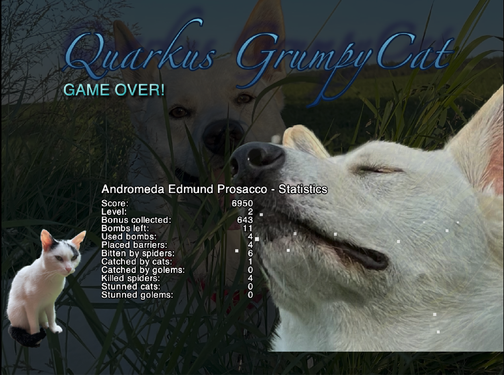

# quarkus-grumpycat game

This Game uses Quarkus, the Supersonic Subatomic Java Framework and HTML 5 / JavaScript.

If you want to learn more about Quarkus, please visit its website: https://quarkus.io/ .

## The Game

This game was inspired by the old Fat-Cat game and by PacMan. You're controlling a dog in a maze which needs to eat all food without being caught by a grumpy cat or other enemies. 

Right now you can control the dog with arrow keys UP, DOWN, LEFT & RIGHT and with W, A, S, D. More keys are:

- *P* PAUSE
- *SPACE* place bomb
- *Shift* + UP/DOWN/LEFT/RIGHT: place barrier in the direction

If the cat gets into an exploding bomb, it stops for 3sec. A bomb can destroy barriers. The level ends if you got all food.
  

All client game logic is currently coded with JavaScript and [MelonJS](https://github.com/melonjs/melonjs).




## Running the applications in dev mode

First you need to startup the server by getting into `quarkus-server` and executing:
```shell script
cd quarkus-server
./mvnw compile quarkus:dev
```

Then you need to open another terminal window and need to get into the client and executing:
```shell script
cd melonjs-client
npm install
npm run dev
```

Make sure that the `environment` variable in `melonjs-client/src/config.js` is set to `local`. 

## Running on Docker / Podman
There are container images ready to be used on [Quay.io](https://quay.io/wpernath/quarkus-grumpycat). Use this command to pull the images to your local repository:

```shell
docker pull quay.io/wpernath/quarkus-grumpycat
docker pull quay.io/wpernath/grumpycat-melonjs
```

To run the server, the required database and the client, you need to have Docker / Podman configured and running. You can use the `docker-compose.yaml` to start the latest version of the game:

```shell
docker-compose src/main/docker/docker-compose.yaml [--detach|-d] up
```

The app is then available under `http://localhost:8085` in your browser.


## Running on Kubernetes / OpenShift

### OpenShift / Kubernetes image deployment in a GitOps way
There are precompiled images available on `quay.io/wpernath/quarkus-grumpycat`. You can either use `latest` tag or use one of the `vx.y.z` tags.

NOTE, for this approach, you need to have the `Crunchy Data Postgres Operator` installed in your Kubernetes environment. 

Just have a look into the [kubernetes-config directory](kubernetes-config). Then apply the `overlays/dev` configuration as usual:

```shell
oc login <log into your openshift cluster>
oc new-project cat-dev
oc apply -k kubernetes-config/overlays/dev
```

This will automatically install a database and the latest DEV versions of the App.


### Using full featured GitOps
To make use of all GitOps features, have a look at the `gitops` folder of this project. 

Your OpenShift / Kubernetes cluster needs to have the following Operators installed:

- OpenShift Pipeline (or Tekton Pipeline)
- OpenShift GitOps (or an ArgoCD instance)
- Crunchy Data Postgres Operator

To install the `cat-ci` project, call:

```shell
./gitops/tekton/pipeline.sh init \
	--force \
	--git-user <your git user> \
	--git-password <your git password> \
	--registry-user <your quay.io user> \
	--registry-password <your quay.io password>
```

To install the `cat-dev` and `cat-stage` projects, call

```shell
oc apply -k ./gitops/argocd
```

To start a pipeline build, call

```shell
./gitops/tekton/pipeline.sh build \
	-u <your quay.io user>
	-p <your quay.io password>
```

To stage your version of quarkus-grumpycat, call something like

```shell
./gitops/tekton/pipeline.sh stage -r v0.2.4
```

This creates a new branch in github.com and tags the current images on quay.io.

## Roadmap

- In the near future there will also be an EnemyMovementResource to store - well - the enemy's movements, as my plan to calculate new positions of the enemies based on current PlayerMovement doesn't work properly (timing issue).

- Refactoring of the JavaScript stuff. I mainly have used this project to learn some JavaScript. Now it's time to refactor everything and to use some more fancy methods to do the same.

- Do not directly use the Player- / EnemyMovement to store the data in the database, but use Apache Kafka or Streams to take the data and then use a Consumer to store the data asynchronously in the database. 

## About the graphics
The map graphics are coming from [LPC Terrain](https://opengameart.org/content/tiled-terrains) and all its authors. Special thanks to all of them!
                    